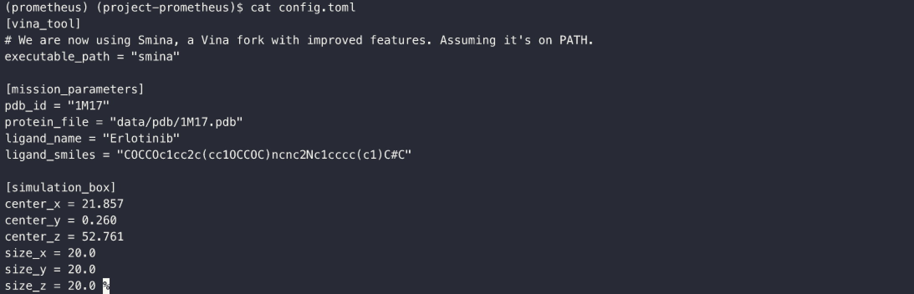
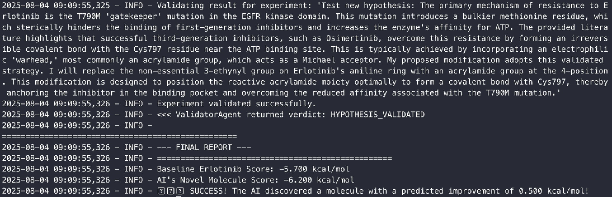

# Project Prometheus: An Autonomous AI Scientist for Drug Discovery

**Project Prometheus is an autonomous AI framework designed to accelerate early-stage scientific discovery.** This system leverages a multi-agent architecture to mimic the scientific method: it consumes and understands research literature, formulates novel hypotheses, conducts virtual experiments, and iteratively learns from the results.

In its initial proof-of-concept run, the system successfully identified a known drug-resistance mechanism in an anti-cancer therapy and autonomously designed, tested, and validated a novel molecule with a predicted improvement in binding affinity—all within a two-hour development window.

[](demo.gif)

*(This silent demo shows an end-to-end run where the AI establishes a baseline, reasons about the science, designs a new molecule, and validates its improved binding affinity.)*

---

## The Scientific Mission: Overcoming Erlotinib Resistance

The project's inaugural mission targets the Epidermal Growth Factor Receptor (EGFR), a key protein in cancer development. The first-generation inhibitor, **Erlotinib**, is effective but often fails due to a specific drug-resistance mutation known as T790M.

The AI's task was to understand this mechanism from the scientific literature and propose a novel molecular modification to Erlotinib to overcome this resistance.

**The Result:** The AI correctly identified that third-generation inhibitors use a **covalent bonding** strategy to overcome resistance. It then autonomously designed a new molecule that incorporated a reactive "warhead" onto the Erlotinib scaffold. In a virtual experiment using the `smina` docking tool, the AI's creation showed a more favorable binding affinity, validating its core hypothesis.

## System Architecture

Prometheus operates through a loop of specialized AI agents:

1.  **Knowledge Base Builder (`build_knowledge_base.py`):** Ingests and processes PDF research papers into a searchable vector database using LanceDB and Sentence-Transformers.
2.  **Hypothesis Agent:** Queries the knowledge base for relevant information, reasons about the science, and proposes a novel, testable hypothesis in the form of a new molecule.
    * **LLM Engine:** This agent utilizes Google's `Gemini 2.5 Pro` via its API to generate the scientific reasoning and molecular structure.
3.  **Experimenter Agent:** Takes the AI-designed molecule and executes a realistic *in silico* experiment (molecular docking) using validated scientific software (`smina` and `Open Babel`).
4.  **Validator Agent:** Parses the results of the experiment, confirms its successful completion, and determines if the AI's hypothesis was validated by the data.

This closed-loop system ensures that the AI's creativity is constantly grounded by real-world (virtual) experimental data, mitigating LLM hallucination and guiding the discovery process with empirical evidence.

## A Glimpse Into the Discovery Loop

The core of Project Prometheus is its ability to reason from evidence and test its own hypotheses. Here are the key moments from a successful discovery run:

#### 1. The Mission Briefing
The process begins by defining the scientific target and parameters in the `config.toml` file. This sets the stage for the entire experiment.



#### 2. The AI's Hypothesis
After running a baseline experiment, the `HypothesisAgent` consumes the scientific literature from its knowledge base. It then formulates a novel hypothesis, explaining its reasoning and outputting a concrete molecular blueprint.

> **AI's Reasoning:** The primary mechanism of resistance to Erlotinib is the T790M 'gatekeeper' mutation... This is typically achieved by incorporating an electrophilic 'warhead,' most commonly an acrylamide group, which acts as a Michael acceptor. My proposed modification adopts this validated strategy. I will replace the non-essential 3-ethynyl group on Erlotinib's aniline ring with an acrylamide group at the 4-position. This modification is designed to position the reactive acrylamide moiety optimally to form a covalent bond with Cys797, thereby anchoring the inhibitor in the binding pocket and overcoming the reduced affinity associated with the T790M mutation.

> **Proposed Molecule (SMILES):**
> ```
> C=CC(=O)Nc1ccc(cc1)Nc1ncnc2cc(OCCOC)c(OCCOC)cc12
> ```

#### 3. The Validated Result
Finally, the `ExperimenterAgent` and `ValidatorAgent` test the new molecule. The final report provides the empirical verdict, confirming a successful outcome with a predicted binding affinity improvement of **0.500 kcal/mol**, achieving a final score of **-6.2 kcal/mol**.



---

## Setup and Execution Guide

Follow these steps to reproduce the autonomous discovery loop on macOS.

### 1. Prerequisites

* [Homebrew](https://brew.sh)
* [Git](https://git-scm.com)

### 2. Environment Setup with Mamba

We use **mamba** to create a dedicated, isolated environment for this project, ensuring all complex scientific dependencies are installed correctly.

#### 2.1 Install Miniforge

```bash
# Download the installer for Apple Silicon (arm64) Macs
curl -L -O "https://github.com/conda-forge/miniforge/releases/latest/download/Miniforge3-MacOSX-arm64.sh"

# Run the installer and initialize your shell
bash Miniforge3-MacOSX-arm64.sh -b -p ~/miniforge3
~/miniforge3/bin/conda init zsh
```

> **Important:** Close and reopen your terminal window to finalize the installation. You should see `(base)` at the start of your prompt.

#### 2.2 Create and Activate the Prometheus Environment

```bash
# Create the environment
mamba create -n prometheus -c conda-forge python=3.10 rdkit smina openbabel

# Activate the environment
mamba activate prometheus
```

Your prompt will now begin with `(prometheus)`.

### 3. Project Configuration

#### 3.1 Clone the Repository and Install Dependencies

```bash
# Clone this repository
git clone https://github.com/mescuwa/project-prometheus.git
cd project-prometheus

# Install remaining Python libraries
pip install -r requirements.txt
```

#### 3.2 Set Your API Key

The Hypothesis Agent requires a Google Gemini API key. Create a file named `.env` in the project root and add your key:

```bash
GEMINI_API_KEY="YOUR_API_KEY_HERE"
```

### 4. Building the Knowledge Base

#### 4.1 Curate the Literature

The AI's reasoning is guided by the literature you provide. Due to copyright, the source papers are **not** included in this repository. Acquire the PDFs cited in the *Citations* section and place them into the `data/literature/` directory.

#### 4.2 Run the Indexer Script

```bash
python scripts/build_knowledge_base.py
```

This script reads your PDFs and builds the local vector database (`knowledge_base.lancedb`).

### 5. Running the Autonomous Experiment

```bash
python scripts/run_milestone_2.py
```

The script runs the baseline experiment, generates and tests a novel hypothesis, and prints a final report comparing the results.

---

## Knowledge Base & Citations

Prometheus stands on the shoulders of giants. The AI's reasoning is guided by a knowledge base built from these seminal papers:

* Lynch, T. J., *et al.* (2004). *Activating Mutations in the Epidermal Growth Factor Receptor Underlying Responsiveness of Non–Small-Cell Lung Cancer to Gefitinib*. **NEJM**, 350(21), 2129–2139. https://doi.org/10.1056/NEJMoa040938
* Pao, W., *et al.* (2004). *EGF receptor gene mutations are common in lung cancers from "never smokers" and are associated with sensitivity of tumors to gefitinib and erlotinib*. **PNAS**, 101(36), 13306–13311. https://doi.org/10.1073/pnas.0405220101
* Pao, W., *et al.* (2005). *Acquired Resistance of Lung Adenocarcinomas to Gefitinib or Erlotinib Is Associated with a Second Mutation in the EGFR Kinase Domain*. **PLoS Medicine**, 2(3), e73. https://doi.org/10.1371/journal.pmed.0020073
* Engelman, J. A., *et al.* (2007). *MET Amplification Leads to Gefitinib Resistance in Lung Cancer by Activating ERBB3 Signaling*. **Science**, 316(5827), 1039–1043. https://doi.org/10.1126/science.1141478
* Jänne, P. A., *et al.* (2015). *Osimertinib or Platinum–Pemetrexed in EGFR T790M–Positive Lung Cancer*. **NEJM**, 372(18), 1689–1699. https://doi.org/10.1056/NEJMoa1411817

### Data Sources

* **Protein Structure:** Epidermal Growth Factor Receptor (EGFR) kinase domain coordinates obtained from the RCSB Protein Data Bank.
  * PDB ID: **1M17**
  * Stamos, J., Sliwkowski, M. X., & Eigenbrot, C. (2002). *Structure of the EGFR kinase domain alone and in complex with a 4-anilinoquinazoline inhibitor*. **JBC**, 277(48), 46265-46272. https://doi.org/10.1074/jbc.M207135200 