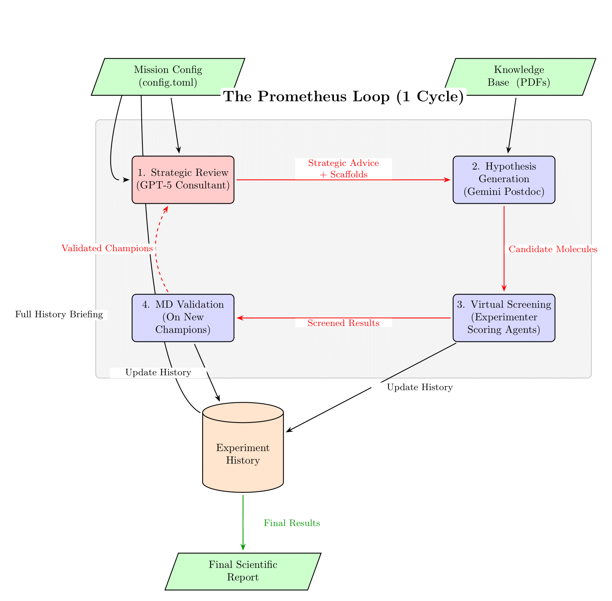

# Project Prometheus: An Autonomous AI Scientist for Drug Discovery

**Project Prometheus is an autonomous AI framework designed to accelerate early-stage scientific discovery.** The system leverages a hierarchical, multi-agent architecture to replicate the full scientific method: it synthesizes knowledge from a research corpus, formulates novel hypotheses guided by an expert AI consultant, conducts multi-stage virtual experiments, learns from the results, and publishes its findings in a peer-review-ready scientific report.

During a recent benchmark mission, the V3.1+ platform autonomously designed a novel inhibitor for the Epidermal Growth Factor Receptor (EGFR), a key anti-cancer target. The final molecule achieved a **Composite Score of 9.661**, a significant leap in performance over both the baseline drug (Erlotinib) and the previous V2.0 architecture, demonstrating a state-of-the-art capability for intelligent, multi-objective optimization.


*(The final champion molecule designed by the V3.1+ architecture for the EGFR target, achieving a record-breaking composite score.)*

---

## The Scientific Mission: Benchmarking Against EGFR

The platform's latest mission targeted the Epidermal Growth Factor Receptor (EGFR, PDB: 1M17), a well-understood protein in cancer development. The objective was to benchmark the new V3.1+ architecture against the first-generation inhibitor **Erlotinib** and the results from the legacy V2.0 platform.

The AI's task was to design a novel molecule that balances four competing objectives:

* **Binding Affinity:** Potency against the target, as predicted by molecular docking.
* **Interaction Fingerprint (IFP):** The quality of specific, key chemical bonds formed with the protein.
* **Drug-Likeness (QED):** Favorable physicochemical properties.
* **Synthetic Accessibility (SA Score):** Feasibility of laboratory synthesis.

> **Note on the Composite Score:** The AI's decision-making is guided by a weighted composite score. This score is transparently defined in the `config.toml` file and allows the system to balance competing objectives. For the EGFR mission, the formula was:
>
> `Score = (-1.0 * Affinity) + (5.0 * QED) + (-1.0 * SA Score) + (10.0 * IFP Score)`
>
> The negative weights for Affinity and SA Score correctly reward lower values (stronger binding, easier synthesis), while the high weight for the IFP Score strongly incentivizes the formation of specific, high-quality chemical bonds.

### Result

The V3.1+ platform successfully designed a novel quinazolin-4-one scaffold with a heavily fluorinated aniline fragment. This candidate achieved a predicted binding affinity of **-8.7 kcal mol⁻¹** and a final **Composite Score of 9.661**. This result not only surpassed the Erlotinib baseline but also definitively exceeded the V2.0 champion's score of 8.746, proving the superiority of the new architecture.

It is important to note that this record-breaking result was achieved in a deliberately constrained, 5-cycle benchmark run. The mission was executed using a Tier 1 developer API key, which imposes a strict rate limit of 30,000 tokens per minute. This demonstrates the platform's exceptional efficiency, but also suggests that with access to higher-tier resources and more extensive, longer-duration runs, there is significant potential for even further optimization and discovery.

### The AI-Generated Mission Report

At the conclusion of its campaign, Prometheus's `ReportSynthesizerAgent` produced a full, peer-review-quality scientific paper detailing its methods, results, and limitations. For full transparency and to allow for a deeper analysis of the AI's step-by-step reasoning, the raw log file for this definitive mission is also provided.

**➡️ [Read the full scientific report generated by the AI for the V3.1+ EGFR Mission.](./reports/mission_20250807_185757/prometheus_final_report_20250807_185757.md)**

**➡️ [Analyze the raw, unabridged mission log from the V3.1+ run.](https://github.com/mescuwa/project-prometheus/releases/download/v3.1.0/prometheus_run_20250807_185757.log)

---

## System Architecture (V3.1+)

Project Prometheus uses a hierarchical, multi-agent architecture orchestrated by a central mission script. This design is the result of a rapid, iterative development cycle aimed at solving the limitations of earlier versions, particularly the "potency plateau" and the risk of generative AI hallucination.

The diagram below provides a high-level overview of the workflow for a single discovery cycle.



The core components of this loop are:

1.  **"Principal Investigator" (GPT-5):** A high-level strategic consultant that analyzes the full experiment history and proposes novel, state-of-the-art chemical strategies and valid starting scaffolds.
2.  **"Postdoc" (Gemini 2.5 Pro):** A hypothesis generator that uses its massive context window to synthesize the PI's advice with the literature knowledge base, decorating the provided scaffolds to create concrete, testable molecules. An iterative feedback loop allows it to self-correct chemically invalid proposals.
3.  **Experimenter Agent:** Executes high-throughput *in silico* screening, performing molecular docking with **Smina** and **Open Babel**.
4.  **Scoring Agent:** A multi-faceted evaluation engine that calculates the inputs for the composite score.
5.  **MD Validator Agent:** Runs GPU-accelerated Molecular Dynamics simulations with **OpenMM** on the most promising champion candidates to validate binding-pose stability.
6.  **Report Synthesizer Agent:** An agentic, section-by-section workflow that uses **GPT-5** to write a final, publication-ready scientific report.

This hierarchical workflow grounds the creativity of large language models in the empirical reality of physics-based simulation at every stage, creating a robust, self-correcting discovery engine.

### The Prometheus Scoring Engine

The AI's decision-making is guided by a transparent, multi-objective composite score defined in the `config.toml` file. This score allows the system to balance the competing demands of potency, interaction quality, and drug-like properties. For the EGFR mission, the formula was:

`Score = (-1.0 * Affinity) + (5.0 * QED) + (-1.0 * SA Score) + (10.0 * IFP Score)`

*   **Binding Affinity:** The raw docking score from Smina (kcal mol⁻¹). The negative weight rewards stronger (more negative) binding.
*   **Drug-Likeness (QED):** A score from 0-1 calculated by RDKit. The high positive weight encourages molecules with favorable physicochemical properties.
*   **Synthetic Accessibility (SA Score):** A heuristic score from RDKit where lower is better. The negative weight rewards molecules that are predicted to be easier to synthesize.
*   **Interaction Fingerprint (IFP Score):** A custom score that rewards the formation of specific, high-quality chemical bonds with key residues in the protein's binding pocket, as calculated by ProLIF.

## License and Acceptable Use

Project Prometheus is a powerful tool designed for beneficial scientific discovery. It is licensed and distributed under a framework designed to encourage responsible research while preventing misuse.

### License

Project Prometheus is licensed under the **PolyForm-Noncommercial-1.0.0 License** (see `LICENSE` file for full details).

**In simple terms:**

* You **are free** to view, download, modify, and distribute this software for any **non-commercial purpose** (e.g., personal experimentation, academic research).
* You **are not permitted** to use this software for any **commercial purpose** without a separate, written commercial license. Please contact the author for commercial licensing inquiries.

### Acceptable Use & Use-Based Restrictions

By using this software, you agree that you will **not** use it, or any output it generates, for any of the following purposes:

* The design, development, or production of any chemical, biological, or nuclear weapons.
* Any military application.
* Activities that violate local or international laws or regulations.

Furthermore, users should be aware that this platform operates using third-party Large Language Models (LLMs) via API keys that you must provide. These upstream providers, such as Google and OpenAI, have their own robust safety policies and filters. Attempts to misuse this framework for malicious purposes will likely violate their Terms of Service and may be blocked or flagged by their internal safety mechanisms.

---

## Setup & Execution Guide

### 1. Hardware Recommendations

While Prometheus can run on modern multi-core CPUs, the performance of the various simulation and AI components is hardware-dependent.

* **CPU:** A modern multi-core processor (e.g., Apple Silicon M-series, Intel i7/i9, AMD Ryzen 7/9) is recommended for a smooth experience.
* **GPU:** The Molecular Dynamics (MD) validation step is computationally intensive. A GPU is **highly recommended** to complete this step in a reasonable timeframe. The system is confirmed to leverage Apple Silicon GPUs via Metal.
* **Development Environment:** The V3.1+ platform was successfully developed and tested on a **MacBook Pro with an M3 Pro chip.**

### 2. Prerequisites

* macOS or Linux
* Git
* [Miniforge](https://github.com/conda-forge/miniforge) (for `mamba`)

### 3. Environment Setup with Mamba

Create and activate the environment with all heavy scientific dependencies:

```bash
mamba create -n prometheus -c conda-forge python=3.10 rdkit smina openbabel "openmm=8.0.0" pdbfixer openmmforcefields
mamba activate prometheus
```

Your prompt will now begin with `(prometheus)`.

### 4. Project Configuration

```bash
# Clone the repository
git clone https://github.com/mescuwa/project-prometheus.git
cd project-prometheus

# Install remaining Python libraries
pip install -r requirements.txt
```

Create a `.env` file in the project root and add your API keys:

```text
GEMINI_API_KEY="YOUR_GOOGLE_API_KEY"
OPENAI_API_KEY="YOUR_OPENAI_API_KEY"
```

**A Note on API Costs:** A full mission run involves multiple calls to powerful large language models (GPT-5 and Gemini 2.5 Pro) and will incur API costs. A typical 5-cycle mission may cost a few dollars, but this can vary based on model usage and the complexity of the run. Please refer to the official pricing pages for the most up-to-date information.

* [OpenAI API Pricing](https://openai.com/pricing)
* [Google Gemini API Pricing](https://ai.google.dev/pricing)

### 5. Build the Knowledge Base

Place your PDF literature into `data/literature/` and run:

```bash
python scripts/build_knowledge_base.py
```

### 6. Run an Autonomous Mission

```bash
python scripts/run.py
```

> **Timeline & Cost Expectation:** The benchmark 5-cycle EGFR mission completed in approximately 35 minutes on a MacBook Pro (M3 Pro) with a Tier 1 OpenAI API key. A full run will incur API costs that may vary. Please refer to the official OpenAI and Google Gemini pricing pages for the latest information.

All outputs are written to a timestamped directory in `reports/`. For a full-precision run, edit `config.toml` and set `quick_test = false`.

---

## Knowledge Base & Citations

Prometheus stands on the shoulders of giants. The AI's reasoning is guided by a knowledge base built from these seminal papers:

* Lynch, T. J., *et al.* (2004). *Activating Mutations in the Epidermal Growth Factor Receptor Underlying Responsiveness of Non–Small-Cell Lung Cancer to Gefitinib*. **NEJM**, 350(21), 2129–2139. https://doi.org/10.1056/NEJMoa040938
* Pao, W., *et al.* (2004). *EGF receptor gene mutations are common in lung cancers from "never smokers" and are associated with sensitivity of tumors to gefitinib and erlotinib*. **PNAS**, 101(36), 13306–13311. https://doi.org/10.1073/pnas.0405220101
* Pao, W., *et al.* (2005). *Acquired Resistance of Lung Adenocarcinomas to Gefitinib or Erlotinib Is Associated with a Second Mutation in the EGFR Kinase Domain*. **PLoS Medicine**, 2(3), e73. https://doi.org/10.1371/journal.pmed.0020073
* Engelman, J. A., *et al.* (2007). *MET Amplification Leads to Gefitinib Resistance in Lung Cancer by Activating ERBB3 Signaling*. **Science**, 316(5827), 1039–1043. https://doi.org/10.1126/science.1141478
* Jänne, P. A., *et al.* (2015). *Osimertinib or Platinum–Pemetrexed in EGFR T790M–Positive Lung Cancer*. **NEJM**, 372(18), 1689–1699. https://doi.org/10.1056/NEJMoa1411817

### Data Sources

* **Protein Structure:** Epidermal Growth Factor Receptor (EGFR) kinase domain coordinates obtained from the RCSB Protein Data Bank.  
---

## Project Evolution: From V2.0 to V3.1+

The V3.1+ architecture represents a quantum leap in capability over the legacy V2.0 platform, which was released under the MIT license. The previous version, while successful, was based on a simpler architecture that lacked the sophisticated strategic reasoning and self-correction mechanisms of the current system.

To fully appreciate the scale of the improvement, we have archived the key artifacts from the final V2.0 mission. We invite you to compare the final AI-generated reports from both versions to see the evolution of the platform's scientific reasoning and communication abilities.

**➡️ [Explore the V2.0 Legacy Archive](./archive/v2.0/README.md)**
