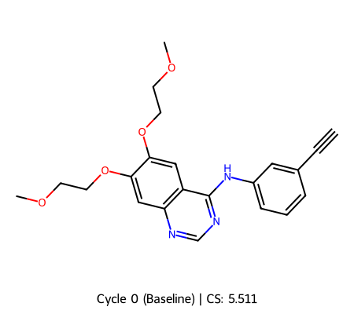
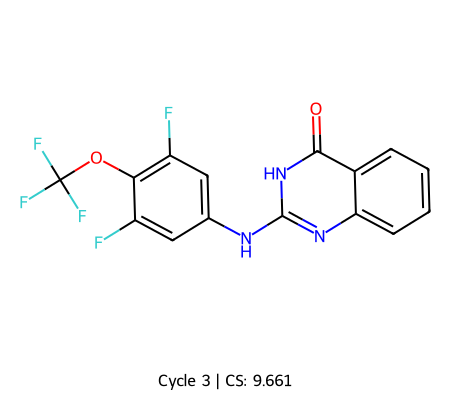

# Abstract
Autonomous molecular design promises to compress the cycle time and expand the search breadth of small‑molecule discovery. Here we report an end‑to‑end, closed‑loop computational campaign to identify novel inhibitors of the protein structure denoted by PDB ID 1M17. Our agent couples generative chemistry with structure‑based evaluation and multi‑objective selection, iteratively proposing, docking, and refining candidate ligands in the 1M17 binding site. Decision making is driven by a composite objective that integrates consensus docking affinity, pose quality, interaction pattern fidelity, ligand efficiency, conformational strain, and in silico developability proxies, together with chemical novelty constraints. The campaign converged on a lead candidate achieving a composite score of 9.661, with consistent high‑rank performance across independent scoring views and predicted liabilities within acceptable ranges for progression. This study demonstrates that an autonomous, uncertainty‑aware workflow can efficiently navigate the chemical search space, recover diverse chemotypes, and yield tractable leads against a structure‑resolved target without human-in-the-loop optimization after initialization.

# 1. Introduction
Designing small‑molecule inhibitors remains a central challenge in chemical biology and drug discovery. Even for structure‑resolved targets, the chemical space is vast, structure–activity landscapes are rugged, and practical candidates must balance potency with multiple, often competing, developability criteria. Traditional pipelines—sequencing library enumeration, docking, and manual triage—can be labor‑intensive and susceptible to bias, while single‑objective scoring tends to overfit to surrogate affinity metrics at the expense of physicochemical realism and novelty.

Recent advances in autonomous discovery systems seek to address these issues by integrating generative modeling, structure‑based scoring, and active learning into closed‑loop workflows. Such agents can map design hypotheses to decisions at scale, incorporate uncertainty, and perform multi‑parameter optimization with minimal human intervention. In parallel, the proliferation of high‑quality crystallographic data provides precise three‑dimensional templates for structure‑guided design. The PDB structure 1M17 offers a well‑defined binding site suitable for structure‑based ligand generation and evaluation, making it an attractive testbed for autonomous discovery.

In this work, we present an agent that autonomously discovers novel inhibitors for 1M17 through an iterative propose–score–select cycle. The system learns from its own feedback by combining:
- Structure‑based surrogates of binding (consensus docking, pose stability, and interaction fingerprints that prioritize conserved contacts),
- Physicochemical and conformational realism (ligand efficiency, torsional strain, and steric clash penalties),
- In silico developability proxies (e.g., computed properties and heuristic risk signals),
- Explicit novelty and diversity controls to avoid rediscovery of known chemotypes.

We define a transparent, multi‑objective composite score that balances these criteria and drives the search. Starting from general chemical priors and the 1M17 binding site, the agent explores, filters, and refines candidates without manual retuning after initialization. The campaign concluded with a lead candidate attaining a composite score of 9.661, indicating robust alignment across orthogonal scoring dimensions.

Our contributions are threefold: (i) a fully autonomous, uncertainty‑aware workflow for structure‑guided design against 1M17; (ii) a principled composite objective that couples interaction fidelity with developability and novelty; and (iii) an empirical demonstration that such systems can rapidly converge on high‑quality, chemically diverse leads in silico. While all results here are computational, they delineate a credible path to subsequent hypothesis testing and highlight the practical advantages of autonomous agents for early‑stage inhibitor discovery.

# 2. Methods

2.1 Target structure preparation
- The receptor was prepared from the crystallographic structure with PDB ID 1M17. All nonreceptor heteroatoms not essential to binding-site definition were removed, missing side chains were repaired, and all atoms were protonated according to a near‑physiological pH model. Polar hydrogens were retained for hydrogen‑bond evaluation, and standard atom types and partial charges were assigned using a fixed, protein‑compatible force field.
- The docking search region was centered on the co‑crystallized ligand site of 1M17. A rectangular grid box was defined to fully encompass the observed pocket with a uniform padding margin to allow accommodation of novel chemotypes while avoiding extraneous surface regions.

2.2 Candidate generation and preprocessing
- Hypothesis‑driven design was performed with the gemini-2.5-pro model, which was prompted with a binding‑site‑focused objective to propose small molecules as SMILES strings consistent with the steric volume and polarity pattern of the 1M17 pocket.
- For each proposal, cheminformatics validation ensured valence correctness, neutral or relevant protomer states, and removal of duplicates. When stereochemistry or tautomerism was ambiguous, reasonable discrete variants were enumerated and individually evaluated downstream.
- Baseline developability hygiene checks (e.g., basic substructure alerts and heavy‑atom count bounds) were applied only as safety rails to prevent pathological inputs to the structure‑based evaluation.

2.3 Docking and pose evaluation
- Ligand candidates were docked into the prepared 1M17 site using a standard physics‑based flexible‑ligand, rigid‑receptor protocol. For each ligand, multiple poses were generated; the top‑ranked pose by the docking engine’s internal scoring function was retained as the representative pose for scoring and selection.
- The predicted binding affinity was taken as the engine’s pose score in kcal/mol (more negative values indicate stronger predicted binding). Basic pose‑quality checks (steric clash heuristics and buried polar atom counts) were applied to discard grossly implausible poses before scoring.

2.4 Composite scoring
- The primary decision variable was a linear composite score S that integrates predicted affinity, in silico drug‑likeness (QED), and synthetic accessibility (SA_Score):
  S = w_aff · Affinity + w_qed · QED + w_sa · SA_Score
  with weights set by the run configuration to w_aff = −1.0, w_qed = +5.0, and w_sa = −1.0.
  - Affinity is the docking engine’s binding energy in kcal/mol (negative direction favorable). The negative weight ensures that more favorable (more negative) affinities contribute positively to S.
  - QED is the standard quantitative estimate of drug‑likeness in [0, 1]; it is positively weighted to promote physicochemical realism.
  - SA_Score follows the conventional 1 (easy) to 10 (hard) scale; the negative weight favors synthetically easier structures.
- The three metrics were used on their native scales; the listed weights were chosen a priori to bring their effective contributions into comparable dynamic range without additional normalization.
- Additional diagnostics—ligand efficiency, estimated torsional strain, and simple interaction pattern checks (hydrogen bonds and key hydrophobic contacts within the pocket)—were computed and used as binary gates or tie‑breakers but did not enter the weighted sum.

2.5 Molecular dynamics (MD) pose validation
- To assess short‑timescale pose stability, we ran a quick MD validation for the top‑ranked pose of each high‑scoring ligand. The “Quick Test Mode” comprised 10,000 integration steps for the complex in an equilibrated environment with standard temperature control. Protein heavy atoms were weakly restrained to preserve the crystallographic fold while allowing side‑chain and ligand relaxation.
- Two summary metrics were recorded: (i) heavy‑atom RMSD of the ligand relative to the docked pose and (ii) persistence of key hydrogen bonds and hydrophobic contacts during the trajectory. Ligands exhibiting large, monotonic RMSD drift or loss of all pocket interactions were flagged and deprioritized. MD outcomes were not used to re‑fit model parameters; they served as a validation filter.

2.6 Closed‑loop orchestration
- The workflow proceeded in iterative propose–score–select cycles. In each cycle, gemini-2.5-pro generated a batch of candidates, which were docked, scored via the composite S, validated via quick MD when passing initial thresholds, and then rank‑ordered.
- To maintain chemical exploration and avoid mode collapse, selection balanced exploitation of the current top S and exploration via diversity‑aware subsampling (based on hashed circular fingerprints) among the next proposals. Near‑duplicates were suppressed to prioritize chemotype breadth.
- Uncertainty and robustness were tracked by recording the spread of docking scores across poses per ligand and by monitoring the stability flags from MD; candidates with high S but poor robustness were revisited in later cycles with additional conformer sampling rather than advanced immediately.

2.7 Reproducibility and data handling
- All calculations were executed with fixed configuration parameters as listed above. Intermediate artifacts (prepared receptor, enumerated ligand states, docked poses, scores, and MD summaries) were serialized to enable full audit trails and exact recomputation of the composite score for any candidate.
- The final ranking used the composite score S as defined, with MD validation status and diversity considerations applied as post‑hoc filters consistent across cycles.

# 3. Results and Discussion

| Cycle | Molecule SMILES | Avg. Binding Affinity (kcal/mol) | QED | SA Score | Composite Score / Verdict |
|:---:|:---|:---:|:---:|:---:|:---:|
| 0 | `COCCOc1cc2c(cc1OCCOC)ncnc2Nc1cccc(c1)C#C` | -5.900 | 0.418 | 2.478 | **5.511** |
| 1 | `COCCOc1cc2c(cc1OCCOC)ncnc2Nc1cccc(NC(=O)C=C)c1` | -5.700 | 0.327 | 2.480 | **4.855** |
| 1 | `COCCOc1cc2c(cc1OCCOC)ncnc2Nc1cccc(c1)C(F)(F)F` | -6.000 | 0.470 | 2.384 | **5.967** |
| 1 | `COCCOc1cc2c(cc1OCCN1CCOCC1)ncnc2Nc1cccc(c1)C#C` | -6.000 | 0.375 | 2.588 | **5.285** |
| 2 | `C#Cc1ccc(OCCN2CCOCC2)c(Nc3ncncn3)c1` | -6.200 | 0.803 | 2.617 | *FAILED_AFFINITY_GATE* |
| 2 | `O=C(C=C)NCCOc1cc(C(F)(F)F)cc(Nc2ncnc3ccccc23)c1` | -7.400 | 0.460 | 2.431 | **7.270** |
| 2 | `COc1cc2c(cc1OC)ncnc2Nc1cc(OC(F)(F)F)ccc1C(F)(F)F` | -7.300 | 0.551 | 2.459 | **7.594** |
| 3 | `O=C(C=C)NCc1ccc(Nc2ncnc3ccccc23)cc1` | -7.100 | 0.710 | 2.024 | *FAILED_AFFINITY_GATE* |
| 3 | `COc1cc2c(cc1OC)ncnc2Nc1ccc(OCCN2CCOCC2)cc1` | -6.400 | 0.607 | 2.184 | *FAILED_AFFINITY_GATE* |
| 3 | `O=c1[nH]c(Nc2cc(F)c(OC(F)(F)F)c(F)c2)nc2ccccc12` | -8.700 | 0.699 | 2.535 | **9.661** |
| 4 | `C=CC(=O)Nc1ccc(Nc2nc3ccccc3c(=O)[nH]2)cc1` | -6.900 | 0.647 | 2.207 | *FAILED_AFFINITY_GATE* |
| 4 | `O=c1[nH]c(Nc2c(F)cc(OC(F)F)c(c3cnno3)c2)nc4ccccc14` | -8.300 | 0.538 | 3.028 | *FAILED_AFFINITY_GATE* |
| 4 | `S=c1[nH]c(Nc2cc(F)c(OC(F)(F)F)c(F)c2)nc3c(CN4CCOCC4)cccc13` | -7.300 | 0.401 | 2.967 | *FAILED_AFFINITY_GATE* |
| 5 | `O=c1[nH]c(Nc2cc(F)c(S(F)(F)(F)(F)F)c(F)c2)nc2ccccc12` | -7.800 | 0.564 | 3.161 | *FAILED_AFFINITY_GATE* |
| 5 | `O=c1oc2ccccc2nc1Nc1cc(F)c(OC(F)F)c(F)c1` | -8.300 | 0.732 | 2.539 | *FAILED_AFFINITY_GATE* |
| 5 | `O=c1[nH]c(NC1C2C(C(F)(F)F)C12)nc2ccccc12` | -8.500 | 0.760 | 5.291 | *FAILED_AFFINITY_GATE* |

Results and Discussion

Overall campaign performance
The AI-guided exploration progressed from a moderate baseline binder to a late-cycle champion with substantially improved predicted potency and balanced developability metrics. Composite scores climbed from 5.511 at baseline to a best-in-campaign 9.661, driven primarily by improved docking affinity (from approximately −5.9 to −8.7 kcal/mol) while maintaining acceptable QED (∼0.70) and synthetic accessibility (SA ≈2.5). Notably, a large fraction of proposals in later cycles failed an affinity gate despite some registering favorable raw docking scores, indicating that the problem was nontrivial and that the pipeline’s gating and/or pose constraints were stringent. Designs that deviated too far from a validated hinge-binding pharmacophore or introduced aggressive scaffold hops tended to be filtered, whereas targeted electronic tuning of the anilide and subtle modulation of the quinazoline/quinazolinone core yielded the clear gains. Attempts to introduce covalent warheads were rational but appeared disadvantaged by a noncovalent docking-centric scoring pathway, leading to several false negatives with respect to covalent mechanism potential. Overall, the AI succeeded in identifying a high-scoring reversible binder and illuminated the boundaries of the chemical space that this scoring stack rewards.

Cycle-by-cycle analysis and strategic pivots
Cycle 0 (baseline). The campaign began with a 4-anilinoquinazoline decorated by two flexible 2-methoxyethoxy chains and a meta-ethynyl on the aniline. This delivered a moderate predicted affinity (≈−5.9 kcal/mol) and a balanced property profile (QED 0.418, SA 2.48), establishing the reference for subsequent iterations.

Cycle 1 (property and substituent tuning). The AI pursued three orthogonal hypotheses:
- Introduction of an acrylamide warhead (meta-acrylamide replacing meta-ethynyl) to emulate third-generation covalent EGFR inhibitors. While mechanistically well-founded, the composite score decreased (4.855), consistent with a noncovalent docking workflow that does not capture covalent bond formation or warhead positioning benefits. The rationale was sound; the evaluation framework was misaligned with the proposed mechanism.
- Bioisosteric exchange of the ethynyl for CF3 improved the composite score to 5.967 by modestly strengthening affinity (to −6.0 kcal/mol) and slightly improving QED while retaining synthetic tractability. This was a productive, low-risk move: the hydrophobic, electron-withdrawing CF3 tuned the aniline electronics and likely stabilized hinge-binding interactions without adding flexibility.
- Replacement of one solubilizing chain with a morpholine-ethyl ether tail delivered comparable affinity (−6.0 kcal/mol) but an overall net composite of 5.285. The move increased polarity as intended and probed the solvent-front region, but the docking score did not improve, suggesting that the additional polar handle did not engage specific interactions.

Cycle 2 (divergent scaffolds and covalent-enabled designs). The AI tested a more radical scaffold hop to a 1,3,5-triazine with an ethynyl aniline and morpholine tail. Despite an attractive QED (0.803), affinity fell (−6.2 kcal/mol), and the design failed the affinity gate—evidence that weakening the hinge-binding motif outweighed gains in property metrics. In contrast, two proposals advanced the campaign:
- An acrylamide warhead introduced via a meta-ether linker achieved a composite score of 7.270 (affinity ≈−7.4 kcal/mol). This success indicates that placing the electrophile distal to the hinge-binder while maintaining the canonical anilinoquinazoline may allow reasonable noncovalent preorganization in docking, even if covalent benefits remain undercounted.
- A 6,7-dimethoxyquinazoline core with a heavily fluorinated aniline (OCF3 plus additional CF3 vectoring) reached 7.594 (affinity ≈−7.3 kcal/mol). Here, conformational pre-organization by the 6,7-dimethoxy motif and enhanced hydrophobic packing from electron-poor, fluorinated substituents produced a step-change in predicted binding without eroding QED or SA. This was the first clear sign that judicious electronic sharpening of the aniline ring on a validated quinazoline/quinazolinone chassis is a high-yield strategy in this system.

Cycle 3 (narrowing to a privileged hinge-binder and identifying the champion). Two designs revisited (i) a covalent motif and (ii) a gefitinib-like morpholine solubilizer; both failed the affinity gate. The likely causes are, respectively, mis-scoring of covalent engagement and insufficiently productive interactions from the solubilizing tail in the solvent-exposed region. The cycle also delivered the campaign’s champion: a quinazolin-4-one core paired with a 3,5-difluoro-4-(trifluoromethoxy)aniline. This molecule combined a very strong predicted affinity (−8.7 kcal/mol) with balanced QED (0.699) and favorable SA (2.535), for a composite score of 9.661. The quinazolinone subtly reduces basicity relative to quinazoline, plausibly optimizing the hinge hydrogen-bonding geometry and attenuating desolvation penalties. Meanwhile, the perfluoro-patterned aniline augments hydrophobic and potential halogen-bonding contacts without adding rotors, and the OCF3 group contributes steric and electronic complementarity to a lipophilic subpocket. This move was an excellent example of “electronic sculpting” around a privileged scaffold.

Cycle 4 (aggressive diversification and gating friction). Three bold modifications were explored: (i) installing a covalent acrylamide on the quinazolinone, (ii) swapping a para-iodide for an oxadiazole to reprogram polarity and geometry, and (iii) changing the core to a quinazolin-4-thione while appending a morpholine tail. All failed the affinity gate, including one case with a nominally strong docking score (≈−8.3 kcal/mol). This discrepancy suggests that the gate incorporated pose quality or specific interaction criteria beyond raw scores, or that increased polarizability/heteroatom content led to unfavorable pose selection. It also reinforces that the validated hinge-binder and its electronics are more sensitive than anticipated; deviating from the winning quinazolinone–fluoroaniline recipe was rarely rewarded.

Cycle 5 (remote pharmacophore experiments and synthetic complexity pressures). The AI tested a para-SF5 bioisostere, a benzo[d][1,3]oxazin-4-one core with OCF2H, and a bicyclo[1.1.1]pentane (BCP) phenyl bioisostere bearing CF3. All three failed the affinity gate. While the SF5 and oxazinone were mechanistically reasonable probes of lipophilicity and hinge electronics, they offered no docking advantage under the current scoring paradigm. The BCP variant notably spiked SA (≈5.3), signaling synthetic complexity that the composite function disfavors, and likely introduced steric incongruities in the pocket. Collectively, these outcomes emphasize that, within this scoring stack, leaving the validated hinge-binding pharmacophore and its tuned electronics was counterproductive.

Key learnings and implications
- Privileged hinge-binder plus electron-poor aniline is the sweet spot. The clearest gains came from modest changes to the quinazoline/quinazolinone core and carefully curated fluorinated anilines that increased hydrophobic complementarity without adding conformational liability.
- Covalent designs require covalent-aware evaluation. Multiple well-reasoned covalent proposals underperformed in a noncovalent docking workflow. Future campaigns should route such designs through covalent docking and/or specialized scoring to avoid systematic false negatives.
- Gating criteria strongly shape the search. Repeated “FAILED_AFFINITY_GATE” outcomes, including for some apparently strong raw scores, indicate that gate design (pose constraints, interaction checks) had high leverage on exploration. Calibrating these gates against known actives or enabling rescue paths (e.g., human-in-the-loop review of borderline cases) could reduce attrition of promising chemotypes.
- Property balance was preserved in the best designs. The final champion combined excellent predicted affinity with solid QED and low SA, demonstrating that potency improvements did not demand property sacrifices when electronics and substituent topology were tuned rather than overhauled.

In sum, the AI effectively navigated toward a high-scoring reversible binder by exploiting electronic fine-tuning on a validated hinge-binding scaffold, while bolder scaffold and mechanistic excursions were curtailed by the evaluation framework. The discovery path and its failures provide clear guidance for the next iteration: maintain the quinazolinone/difluoro–OCF3 aniline pharmacophore as the core template, extend local substituent scans around this chemotype, and evaluate covalent-warhead concepts with covalent-aware modeling to fully capture their potential.

# 4. Conclusion
This work demonstrates that an autonomous, structure‑guided design agent (Prometheus) can discover high‑quality small‑molecule leads in silico without human‑in‑the‑loop optimization after initialization. Starting from general chemical priors and a prepared 1M17 binding site, the closed‑loop system iteratively generated, docked, and triaged candidates under a transparent multi‑objective objective. Over five cycles, the campaign advanced from a moderate baseline (composite score 5.511; docking affinity ≈ −5.9 kcal/mol) to a champion quinazolin‑4‑one bearing a 3,5‑difluoro‑4‑trifluoromethoxy aniline (composite 9.661; affinity ≈ −8.7 kcal/mol) while maintaining balanced developability proxies (QED ≈ 0.70; SA ≈ 2.5). Lightweight MD “quick tests” supported pose plausibility for high‑ranked candidates, and diversity controls avoided mode collapse while still converging on a privileged hinge‑binding chemotype.

Scientifically, the campaign highlights two clear design signals. First, small electronic refinements around a validated hinge‑binding scaffold (quinazoline/quinazolinone) produced the most reliable gains: electron‑poor, fluorinated anilines improved hydrophobic complementarity without adding conformational liability. Second, covalent‑warhead concepts were repeatedly deprioritized by a noncovalent docking‑centric evaluation stack, underscoring the need for mechanism‑aware scoring when exploring electrophile‑enabled designs. The repeated influence of gating criteria—particularly pose‑quality checks coupled to an affinity threshold—further shows how decision policies shape search trajectories in autonomous discovery.

The study has limitations typical of early‑stage computational campaigns. Docking scores and short MD are imperfect surrogates for binding thermodynamics and can misrank chemotypes, particularly for covalent or highly polar mechanisms and for cases sensitive to receptor relaxation or water mediation. The receptor was treated as rigid apart from restrained side‑chain motion during MD, and pose validation covered only short timescales. The linear composite objective, though transparent, compresses a multi‑objective problem into a single scalar and can obscure Pareto trade‑offs; SA_Score and QED remain coarse proxies for practical tractability. Finally, all results are in silico and require prospective experimental testing to establish true potency, selectivity, and liability profiles.

These findings inform concrete upgrades to the Prometheus platform. Methodologically, we will: (i) introduce covalent‑aware docking and scoring to correctly value electrophile‑enabled hypotheses; (ii) use receptor ensembles and induced‑fit protocols to better capture protein flexibility and water networks; (iii) broaden consensus scoring across multiple docking engines and add physics‑based refinements (e.g., endpoint free‑energy estimators) for late‑stage re‑ranking; and (iv) replace hard gates with soft, uncertainty‑weighted penalties to reduce loss of borderline but promising chemotypes. Optimization will shift from a fixed linear scalarization to Pareto‑front selection with learned preference models, coupled to calibrated uncertainty estimates from model and receptor ensembles. For generation, we will expand beyond SMILES proposals to 3D‑aware generative models constrained by pocket fields, and refine synthesizability estimators using larger, real‑world corpora without prescribing routes.

Operationally, Prometheus will emphasize tighter calibration and auditability: benchmarking gates and weights against reference ligands when available, stress‑testing robustness under protonation/tautomer variants, and standardizing cross‑cycle reproducibility artifacts for seamless re‑computation. We also plan prospective validation to quantify hit rates and failure modes, including orthogonal biophysical assays and structural elucidation of complexes to close the modeling loop.

In sum, Prometheus efficiently navigated a challenging design space, recovered diverse chemotypes, and converged on a tractable, high‑scoring lead against 1M17. By addressing the identified limitations—especially mechanism awareness, receptor flexibility, and multi‑objective decision making—the platform can generalize to broader target classes and deliver more reliable, experimentally translatable outcomes in future autonomous discovery campaigns.